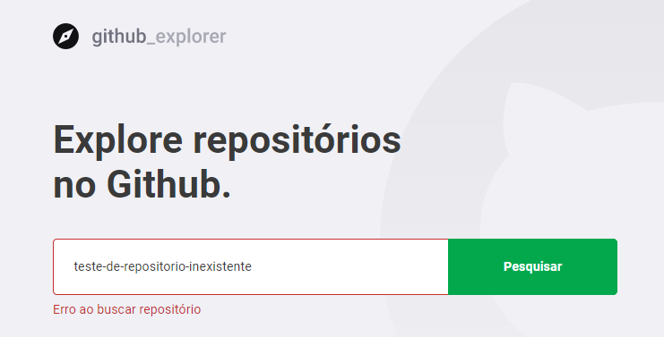
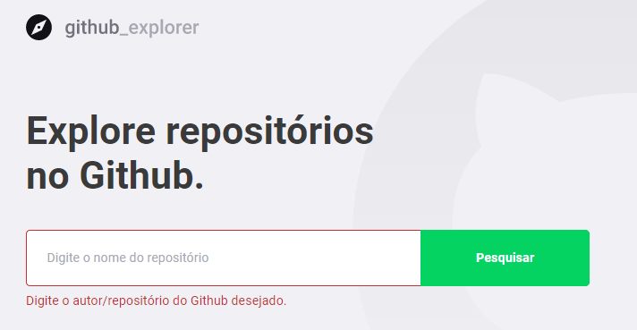

<h1 align="center">
    
</h1>

## 🚀 Tecnologias

Esse projeto foi desenvolvido com as seguintes tecnologias:

- [React];
- [Typescript];
- [Styled Components];
- [Axios]: Tratamento de Requisições HTTP;
- [API GitHub]: Fonte de dados reais;
- [ESLint, Prettier e EditorConfig]: Padronização e identação de código;

## 💻 Projeto

Permite encontrar repositórios de forma bonita e inutuitiva, exibindo informações como: contagem de stars, contagem de forks, contagem e listagem de issues, podendo consultar determinado issue diretamente no Github.

## 🎯 Objetivo

Projeto feito apenas para praticar (estudo).

 

## Telas da Aplicação: 

 

## Tela Inicial:

 

## Tela de detalhes do repositório:

 

 

## Tratamento de Erros:

 

